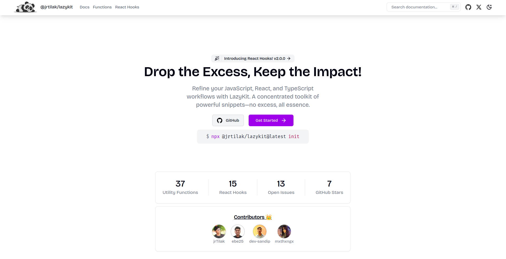

<h1 align="center">
  <br>
  <a href="https://lazykit.thapatilak.com.np/"></a>
  <br>
  @jrtilak/lazykit
  <br>
</h1>

<h3 align="center">Drop the Excess, Keep the Impact!</h3>

---

Refine your JavaScript, React, and TypeScript workflows with LazyKit. A concentrated toolkit of powerful snippets—no excess, all essence.



## Documentation

Visit [here](https://lazykit.thapatilak.com.np/docs/) for detailed documentation.

## Contributing

Visit [here](https://lazykit.thapatilak.com.np/docs/contributing) for contributing guidelines.

## License

Visit [here](./LICENSE) for license information.

## Some Useful Links

- [NPM Package](https://www.npmjs.com/package/@jrtilak/lazykit)
- [Develop Branch](https://lazykit-www-git-dev-tilak-thapas-projects.vercel.app/)
- [Master Branch](https://lazykit.thapatilak.com.np/)

```bash
npx @jrtilak/lazykit@latest init 
```

Thank you for using Lazykit! <3
